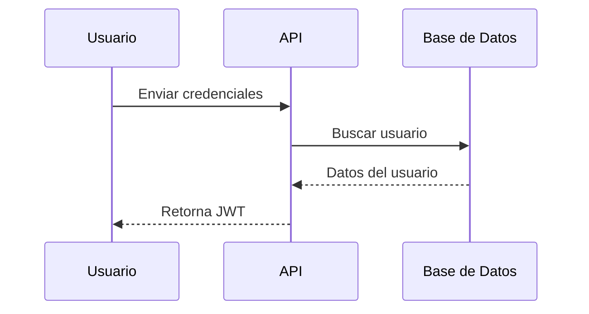
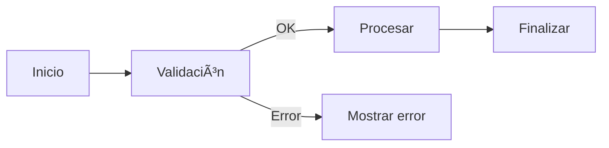
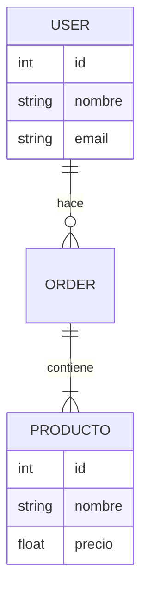
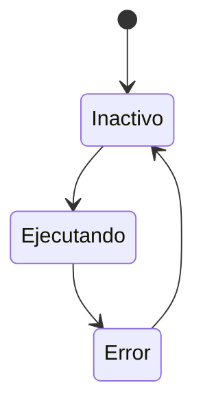
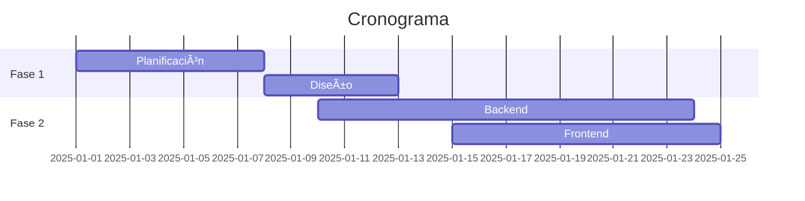

# Pruebas Selenuim
Pruebas en selenuim para aplicacion Core de rentas test Noviembre 2025
# 📘 Guía Completa de Diagramas Mermaid

Este repositorio contiene una colección completa de ejemplos de diagramas utilizando **Mermaid**, el lenguaje de diagramación basado en texto soportado de forma nativa por GitHub.

Mermaid permite documentar procesos, arquitecturas, flujos, estados, clases, bases de datos y más, sin usar herramientas visuales externas.

---

# 📚 ¿Qué es Mermaid?

Mermaid es un lenguaje de marcado que convierte texto en diagramas dinámicos.  
Se usa ampliamente en:

- GitHub (readme, issues, PRs)
- GitLab
- Confluence
- Notion
- Obsidian
- Documentación de proyectos

Es ideal porque:

- Es fácil de mantener
- Funciona perfecto con control de versiones
- El diagrama se actualiza solo con cambios en el texto
- No necesitas herramientas externas

---

# 🧩 Diagramas incluidos en este README

1. Flowchart  
2. Sequence Diagram  
3. Class Diagram  
4. State Diagram  
5. Gantt Chart  
6. ER Diagram  
7. User Journey  
8. Pie Chart  

Puedes usar este README como referencia o plantilla en tus propios proyectos.

classDiagram
    class User {
        +string name
        +string email
        +login()
    }

    class AuthService {
        +generateJWT()
        +validateToken()
    }

    User --> AuthService
mermaid    
stateDiagram-v2
    [*] --> Desconectado
    Desconectado --> Autenticando
    Autenticando --> Autenticado
    Autenticando --> Error
    Error --> Desconectado
# Diagrama del flujo de Login


A continuación se muestra el flujo de autenticación con JWT:

```mermaid
sequenceDiagram
    participant User
    participant FE as Frontend
    participant API

    User->>FE: Ingresa credenciales
    FE->>API: Envía login
    API-->>FE: Retorna JWT
    FE->>API: Petición con Bearer Token
    API-->>FE: Respuesta OK

Nombre del Proyecto

Breve descripción del proyecto, propósito y alcance.

------------------------------------------------------------------------

## 📚 Tabla de Contenido

1.  Descripción General
2.  Arquitectura
3.  Flujos Principales
4.  Modelado de Datos
5.  Estados del Sistema
6.  Cronograma del Proyecto
7.  Contribución
8.  Licencia

------------------------------------------------------------------------

## 🧩 Descripción General

Explicación breve del proyecto y lo que resuelve.

------------------------------------------------------------------------

## 🏗️ Arquitectura

``` mermaid
flowchart TD
    A[Cliente] --> B[API Gateway]
    B --> C[Servicio Auth]
    B --> D[Servicio Principal]
    C --> E[Base de Datos]
    D --> E
```

------------------------------------------------------------------------

## 🔄 Flujos Principales

### 🔐 **Flujo de Autenticación (JWT)**



------------------------------------------------------------------------

### 🧾 **Flujo del Proceso Principal**



------------------------------------------------------------------------

## 🗄️ Modelado de Datos

### **Diagrama ER**



------------------------------------------------------------------------

## 🧠 Estados del Sistema



------------------------------------------------------------------------

## 📅 Cronograma del Proyecto



------------------------------------------------------------------------

## 🤝 Contribución

Explica cómo contribuir (PRs, issues, etc.)

------------------------------------------------------------------------

## 📄 Licencia

Indica el tipo de licencia (MIT, Apache, etc.)
